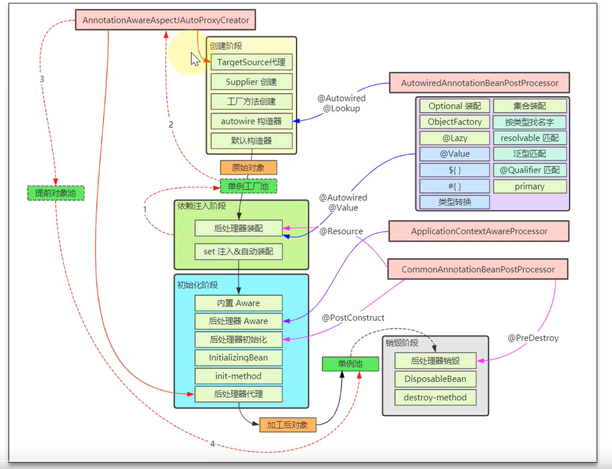

-- -- 
AOP实现三大步骤
```html
@EnableAspectJAutoProxy通过@Import注册一个BeanPostProcessor 
处理AOP
1.在创建Bean时调用BeanPostProcessor解析切面@Aspect,将切面中所有的
通知解析为advisor(通知、切点、通知方法)排好序放入list 并缓存
2.在Bean初始化后调用BeanPostProcessor拿到之前缓存的Advisor判断当前
  Bean是否被切面表达式命中，如果匹配则创建动态代理
3.调用：通过创建的动态代理调用方法执行增强，通过调用链设计模式依次调用通知方法
```
循环依赖
```html
1.只用二级缓存会导致多次创建aop动态代理
2.spring多例Bean没有解决循环依赖
    不会使用缓存
3.构造参数注入不能解决循环依赖，需使用@Lazy注解解决
```

初始化
```html
Aware
    必要
        BeanNameAware
        BeanClassLoaderAware
        BeanFactoryAware
    非必要
        EnvironmentAware
        EmbeddedValueResolverAware
        ResourceLoaderAware
        ApplicationEventPublisherAware
初始化方法的几种方式
    initailizingBean的afterPropertiesSet
    执行bean的init-method属性指定初始化方法
    利用@PostConstruct注解初始化方法
``` 
postProcesser后置处理器
```html
bean工厂处理器
  AutowareAnnotationBeanPostProcesser: 解析@Autoware @Value注解
  CommonAnnotationBeanPostProcesser: 解析 @Resource @PostConstruct @PreDestroy
bean后置处理器
  AnnotationAwareAspectAutoProxyCreator: 支持动态代理
``` 
---
代理模式
```html
jdk:
    代理类通过实现接口的方式实现，需要classloader
cglib:
    通过extends被代理类实现
````